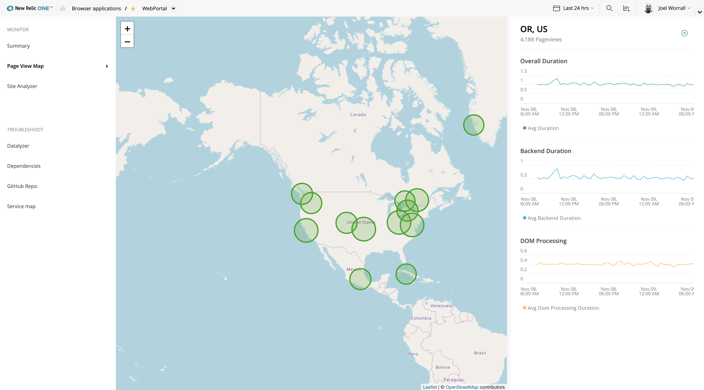

# Page View Map (nr1-pageview-map)

  [](https://snyk.io/test/github/newrelic/nr1-pageview-map)[](https://circleci.com/gh/newrelic/nr1-pageview-map)

## Usage

nr1-pageview-map provides a geographic exploration of Browser application data using the [React Leaflet](https://react-leaflet.js.org/) mapping library.



## Open Source License

This project is distributed under the [Apache 2 license](LICENSE).

## What do you need to make this work?

1. [New Relic Browser Agent(s) installed](https://newrelic.com/products/browser-monitoring) and the related access to [New Relic One](https://newrelic.com/platform).
2. See step 1. :grin:

## Getting started

First, ensure that you have [Git](https://git-scm.com/book/en/v2/Getting-Started-Installing-Git) and [NPM](https://www.npmjs.com/get-npm) installed. If you're unsure whether you have one or both of them installed, run the following command(s) (If you have them installed these commands will return a version number, if not, the commands won't be recognized):

```bash
git --version
npm -v
```

Next, clone this repository and run the following scripts:

```bash
nr1 nerdpack:clone -r https://github.com/newrelic/nr1-pageview-map.git
cd nr1-pageview-map
npm start
```

Visit https://one.newrelic.com/?nerdpacks=local, navigate to the Nerdpack via Entity Explorer > choose a Browser application > click on Page View Map in the left hand navigation, and :sparkles:

# Deploying this Nerdpack

Open a command prompt in the nerdpack's directory and run the following commands.

```bash
# if you ran nr1 nerdpack:clone, this step was already handled
nr1 nerdpack:uuid -g [--profile=your_profile_name]
# to see a list of APIkeys / profiles available in your development environment, run nr1 profiles:list
nr1 nerdpack:publish [--profile=your_profile_name]
nr1 nerdpack:deploy [-c [DEV|BETA|STABLE]] [--profile=your_profile_name]
nr1 nerdpack:subscribe [-c [DEV|BETA|STABLE]] [--profile=your_profile_name]
```

Visit https://one.newrelic.com, navigate to the Nerdpack, and :sparkles:

# Support

New Relic has open-sourced this project. This project is provided AS-IS WITHOUT WARRANTY OR SUPPORT, although you can report issues and contribute to the project here on GitHub.

_Please do not report issues with this software to New Relic Global Technical Support._

## Community

New Relic hosts and moderates an online forum where customers can interact with New Relic employees as well as other customers to get help and share best practices. Like all official New Relic open source projects, there's a related Community topic in the New Relic Explorer's Hub. You can find this project's topic/threads here:

https://discuss.newrelic.com/t/new-relic-one-page-view-map-nerdpack/87602

## Issues / Enhancement Requests

Issues and enhancement requests can be submitted in the [Issues tab of this repository](../../issues). Please search for and review the existing open issues before submitting a new issue.

# Contributing

Contributions are welcome (and if you submit a Enhancement Request, expect to be invited to contribute it yourself :grin:). Please review our [Contributors Guide](CONTRIBUTING.md).

Keep in mind that when you submit your pull request, you'll need to sign the CLA via the click-through using CLA-Assistant. If you'd like to execute our corporate CLA, or if you have any questions, please drop us an email at opensource+nr1-pageview-map@newrelic.com.
